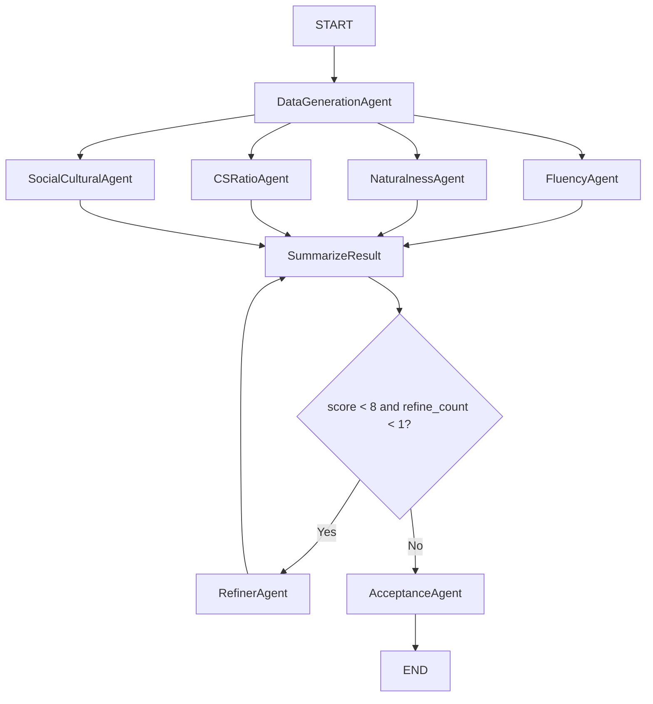
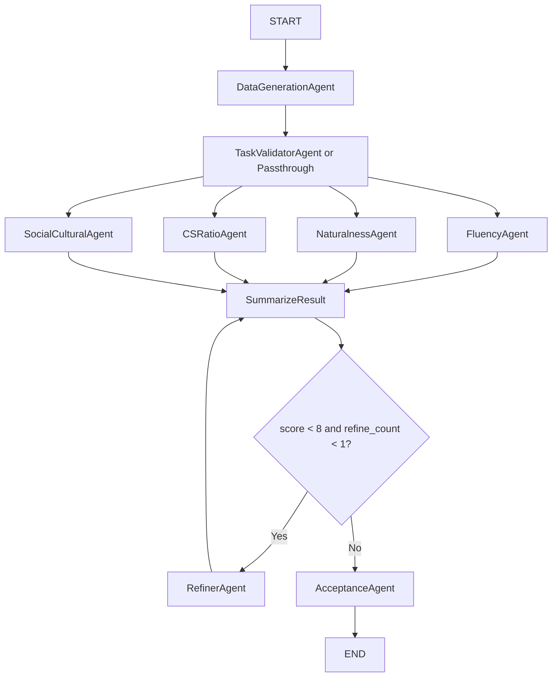

# Baseline vs Modified Pipeline Review

## Scope
- Baseline: `SwitchLingua-main/SwitchLingua-main/core/*`
- Modified: `drive_code/core/*`
- Focus files with major deltas:
  - `node_engine.py`
  - `node_models.py`
  - `prompt.py`
  - `run_french.py`
  - `utils.py`
  - `agents.py`

## Change Magnitude Snapshot
- `node_engine.py`: 183 -> 739 lines, heavy rewrite.
- `prompt.py`: 226 -> 611 lines, expanded task-aware prompts.
- `node_models.py`: 61 -> 181 lines, task-aware state model.
- `run_french.py`: 141 -> 172 lines, graph wiring updated.

---

## Architecture Graphs

## A) Baseline Architecture (`SwitchLingua-main`)

### Baseline Characteristics
- Single-task generation prompt path.
- No explicit task validator stage.
- CS ratio represented as one object: `cs_ratio_result`.
- Scoring directly uses fluency/naturalness/cs_ratio/socio-cultural.

---

## B) Modified Architecture (`drive_code`)

### Modified Characteristics
- Task-aware generation/validation dispatch for `topic`, `sentiment`, `ner`.
- Optional validator stage via `ENABLE_TASK_VALIDATOR`.
- Per-instance CS ratio structure: `cs_ratio_results_per_instances`.
- Task-aware state payload (`task`, `label`, `task_constraints`, `annotations`).

---

## Severity-Ranked Findings

## 1) High: Refiner output is not wired into scored generation output
- File: `drive_code/core/node_engine.py`
- Evidence:
  - `RunRefinerAgent` returns `{"refiner_result": response, "refine_count": 3}`.
  - `SummarizeResult` computes score from `data_generation_result`.
- Impact:
  - Refinement loop may not improve what is actually scored/accepted.

## 2) High: API/network transient failures still fail hard at invoke sites
- File: `drive_code/core/node_engine.py`
- Evidence:
  - Direct `.invoke(...)` in generation and validator calls without exception-level retry/backoff.
- Impact:
  - Single transient timeout/connection failure can abort a scenario.

## 3) High: Acceptance decision does not enforce task validation pass
- File: `drive_code/core/run_french.py`
- Evidence:
  - Branching only checks `score` and `refine_count`.
  - `task_validation_result` is not a hard gate.
- Impact:
  - Samples can be accepted despite task mismatch.

## 4) Medium: Dual scoring contracts exist and can drift
- Files:
  - `drive_code/core/utils.py` (new averaged per-instance ratio path)
  - `drive_code/core/utils2.py` (old `cs_ratio_result` path)
- Impact:
  - Future callers may accidentally use inconsistent score semantics.

## 5) Medium: Logging/debug prints are heavy for production-scale runs
- Files:
  - `drive_code/core/run_french.py`
  - `drive_code/core/node_engine.py`
- Impact:
  - Throughput and log quality degrade at large scenario counts.

## 6) Medium: CS ratio parser still depends on free-form model text parsing
- File: `drive_code/core/node_engine.py`
- Evidence:
  - Manual JSON extraction from model content in `RunCSRatioAgent`.
- Impact:
  - Fragile under prompt/model output drift.

## 7) Low: Type contract mismatch around `social_cultural_result.issues`
- File: `drive_code/core/node_models.py`
- Evidence:
  - Typed as string while downstream handling often expects list-like structures.
- Impact:
  - Export/analysis mismatch risk.

## 8) Low: Legacy dead paths and undefined prompt refs remain
- File: `drive_code/core/node_engine.py`
- Evidence:
  - `RunSampleAgent` / `RunUseToolsAgent` reference prompts not imported.
- Impact:
  - Static analysis noise and maintenance risk.

---

## What Is Better in Modified Code
- Task-aware scenario generation (`task`, `label`, `task_constraints`, `annotations`) is a major functional upgrade.
- Task validator stage introduces explicit task compliance signal.
- Per-instance CS ratio evaluation is better than single aggregate object.
- State model is more expressive and aligned with multi-task operation.
- Environment loading and output handling are improved compared to baseline placeholders.

---

## Verdict
- Overall direction is correct and significantly more capable than baseline.
- The modified pipeline is not fully production-ready yet due to:
  - refine loop effectiveness gap,
  - transient API failure resilience gap,
  - acceptance gating gap (task validity not enforced).

---

## Baseline Overpass Report

## Executive Summary
- `drive_code` clearly surpasses baseline in task coverage, state expressiveness, and analysis granularity.
- The overpass is architectural (multi-task + validation stage), not just prompt tuning.
- Operational hardening is still required before full production confidence.

## Capability Scorecard (Baseline vs Modified)

| Capability | Baseline | Modified | Outcome |
|---|---|---|---|
| Multi-task support (`topic`/`sentiment`/`ner`) | Not explicit | Explicit task-dispatch | Surpassed |
| Task-specific constraints (`label`, `task_constraints`, `annotations`) | Minimal | First-class in state | Surpassed |
| Task validation stage | Absent | Added (`TaskValidatorAgent`) | Surpassed |
| Validator toggle | Absent | `ENABLE_TASK_VALIDATOR` | Surpassed |
| CS ratio granularity | Single object | Per-instance list + aggregate | Surpassed |
| State schema richness | Basic typed dict | Extended task-aware model | Surpassed |
| Output path/env robustness | Placeholder-like baseline | Deterministic env + safer output handling | Surpassed |
| Acceptance rigor | Score-only gate | Score-only gate (still) | Not surpassed |
| Runtime resilience to transient API failures | Weak | Still weak at invoke layer | Not surpassed |
| Refiner effectiveness on scored output | Weak | Still weak unless rewired | Not surpassed |

## What We Overtook (Concrete)

1. Task-aware orchestration
- Baseline had one generation path.
- Modified dispatches generation and validation by `task`, enabling sentiment/NER-specific behavior without forking the whole pipeline.

2. Validation observability
- Baseline had no explicit task-correctness node.
- Modified adds `task_validation_result` and per-instance validation signals, improving diagnosis and auditability.

3. Granular ratio analytics
- Baseline stored one `cs_ratio_result`.
- Modified stores `cs_ratio_results_per_instances`, allowing sentence-level analysis and better Excel/report exports.

4. State contract maturity
- Baseline state lacked task payload contracts.
- Modified state includes `task`, `label`, `task_constraints`, and `annotations`, reducing ambiguity and key-loss in graph transitions.

5. Tooling/export ecosystem
- Modified code now supports task-aware flattening in Excel conversion and can expose both aggregate and sentence-level metrics.

## Remaining Gaps Preventing Full Overpass

1. Acceptance logic does not enforce task correctness
- `task_validation_result.passed` is not a hard gate, so incorrect-task outputs can still be accepted.

2. Reliability under network faults
- Invocation paths still need exception-aware retry/backoff for connection and timeout failures.

3. Refiner loop does not update scored payload
- Refiner output should overwrite or regenerate `data_generation_result` before re-scoring.

## Overall Assessment
- Strategic overpass: **Yes**.
- Operational overpass: **Partial**.
- Release readiness vs baseline: **Better than baseline for capabilities, not yet better for reliability controls**.

---

## Recommended Fix Order
1. Wire `RefinerAgent` output into `data_generation_result` before re-scoring.
2. Add exception-aware retry/backoff for generation/validator/quality invocations.
3. Add acceptance guard: reject/refine when `task_validation_result.passed` is false.
4. Consolidate scoring helpers (`utils.py` vs `utils2.py`) into one canonical contract.
5. Reduce or gate verbose debug prints behind a debug flag.
6. Move CS ratio output to strict structured schema end-to-end.
