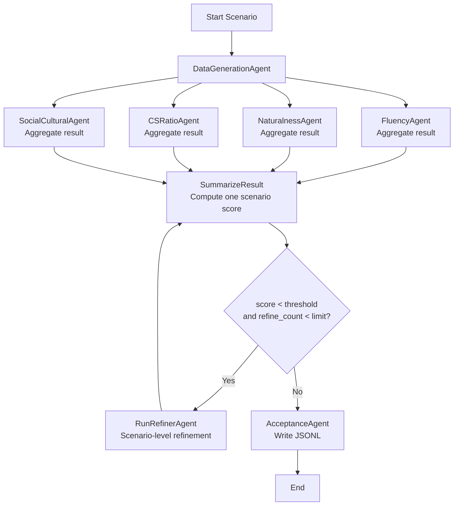
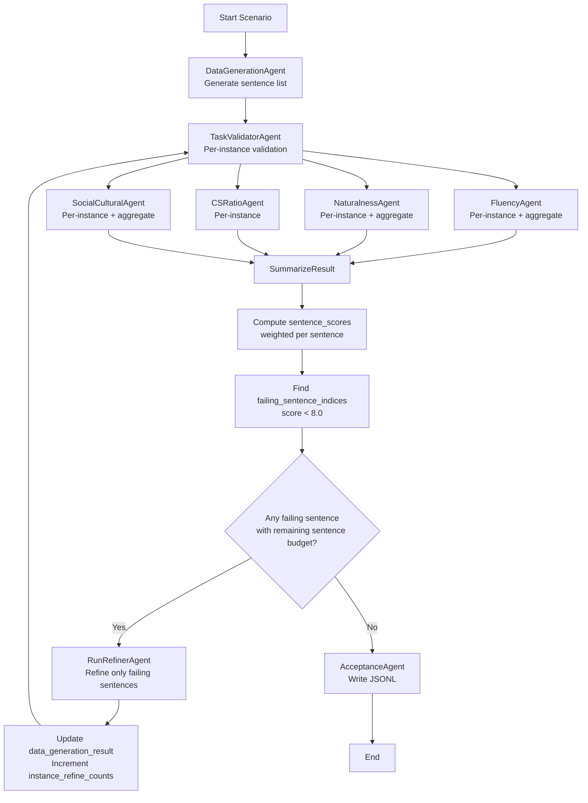

# Old vs New Pipeline Flow (Graph View)

Date: 2026-04-01

Baseline source for this report:
- Folder: `Original_baseLine`
- Entry: `Original_baseLine/core/run_french.py`
- Core nodes: `Original_baseLine/core/node_engine.py`
- Scoring: `Original_baseLine/core/utils.py`
- State model: `Original_baseLine/core/node_models.py`

Current source for this report:
- Folder: `Modified_Version`
- Entry: `Modified_Version/core/run_french.py`
- Core nodes: `Modified_Version/core/node_engine.py`
- Scoring: `Modified_Version/core/utils.py`
- State model: `Modified_Version/core/node_models.py`

## 1. Original Baseline Flow



Baseline implementation behavior (from `Original_baseLine`):
- No `TaskValidatorAgent` stage between generation and evaluation.
- Evaluation agents are aggregate-oriented in baseline flow.
- Router uses scenario-level `score` and global `refine_count`.
- Refiner loop is scenario-level (not sentence-targeted).
- Acceptance writes one JSONL record per scenario.

## 2. Current Modified Flow (Sentence-Level Refinement)



Current implementation behavior (from `Modified_Version`):
- Adds `TaskValidatorAgent` before quality evaluators.
- Tracks per-instance metric arrays.
- Computes `sentence_scores` and `failing_sentence_indices`.
- Refines only failing sentences (targeted refinement).
- Uses `instance_refine_counts` for per-sentence refinement budget.

## 3. At-a-Glance Differences

- Baseline refines using one scenario-level score.
- Current flow computes one score per sentence and refines only failing sentences.
- Baseline has no explicit TaskValidator step before quality evaluation.
- Current flow includes TaskValidatorAgent and keeps per-instance metric arrays.
- Current flow loops through validation + evaluators again after targeted refinement.

## 3.1 Baseline vs Current Decision Logic

Baseline (`Original_baseLine`):
- Decision condition: scenario score threshold only.
- Refinement scope: whole scenario output.
- Loop state: global `refine_count`.

Current (`Modified_Version`):
- Decision condition: sentence-level threshold on each `sentence_scores[i]`.
- Refinement scope: only indices in `failing_sentence_indices`.
- Loop state: `instance_refine_counts` + aggregate `refine_count`.

## 4. Detailed Internals (State In/Out Per Node)

```mermaid
flowchart LR
    S0[(Initial scenario state)] --> DG

    DG[DataGenerationAgent]
    DG -->|out: data_generation_result| TV

    TV[TaskValidatorAgent]
    TV -->|out: task_validation_result\n(per_instance_results)| FL
    TV -->|same input fan-out| NA
    TV -->|same input fan-out| CR
    TV -->|same input fan-out| SC

    FL[FluencyAgent]
    FL -->|out: fluency_results_per_instances\nfluency_result| SM

    NA[NaturalnessAgent]
    NA -->|out: naturalness_results_per_instances\nnaturalness_result| SM

    CR[CSRatioAgent]
    CR -->|out: cs_ratio_results_per_instances| SM

    SC[SocialCulturalAgent]
    SC -->|out: social_cultural_results_per_instances\nsocial_cultural_result| SM

    SM[SummarizeResult]
    SM -->|computes: sentence_scores\nfailing_sentence_indices\nscore (aggregate)| DEC

    DEC{Decision in meet_criteria\nany eligible failing sentence?}
    DEC -->|No| ACC
    DEC -->|Yes| RF

    RF[RunRefinerAgent]
    RF -->|uses: failing_sentence_indices\ninstance_refine_counts| RF2[Refine only failing sentence texts]
    RF2 -->|out: updated data_generation_result\ninstance_refine_counts++\nrefine_count+1| TV

    ACC[AcceptanceAgent]
    ACC -->|writes final state JSONL| END[(End)]
```

Legend:
- Aggregate score: `score` from weighted average across metric dimensions.
- Sentence score: `sentence_scores[i]` for each generated sentence.
- Eligibility: a sentence is eligible for refinement only if below threshold and its refine budget is not exhausted.

## 5. Baseline Internal State Flow (Original_baseLine)

```mermaid
flowchart LR
    S0[(Initial scenario state)] --> DG

    DG[DataGenerationAgent]
    DG -->|out: data_generation_result| FL
    DG -->|fan-out| NA
    DG -->|fan-out| CR
    DG -->|fan-out| SC

    FL[FluencyAgent]
    FL -->|out: fluency_result| SM

    NA[NaturalnessAgent]
    NA -->|out: naturalness_result| SM

    CR[CSRatioAgent]
    CR -->|out: cs_ratio_result| SM

    SC[SocialCulturalAgent]
    SC -->|out: social_cultural_result| SM

    SM[SummarizeResult]
    SM -->|computes: score (aggregate)| DEC

    DEC{score < threshold\nand refine_count < limit?}
    DEC -->|Yes| RF
    DEC -->|No| ACC

    RF[RunRefinerAgent\nScenario-level]
    RF -->|out: refiner_result\nrefine_count +| SM

    ACC[AcceptanceAgent]
    ACC -->|writes JSONL| END[(End)]
```

Notes:
- Baseline graph shown above is from `Original_baseLine` files, not inferred from modified code.
- If you want, we can pin exact line references in a follow-up appendix.
