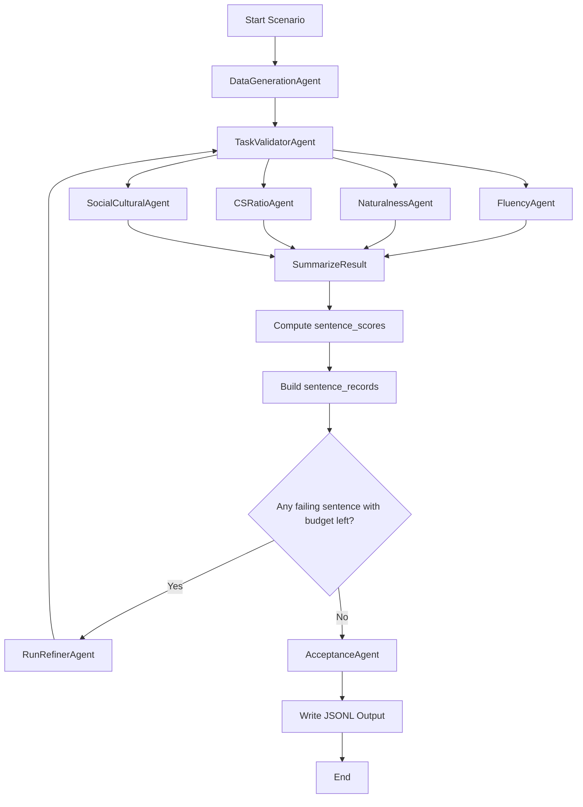
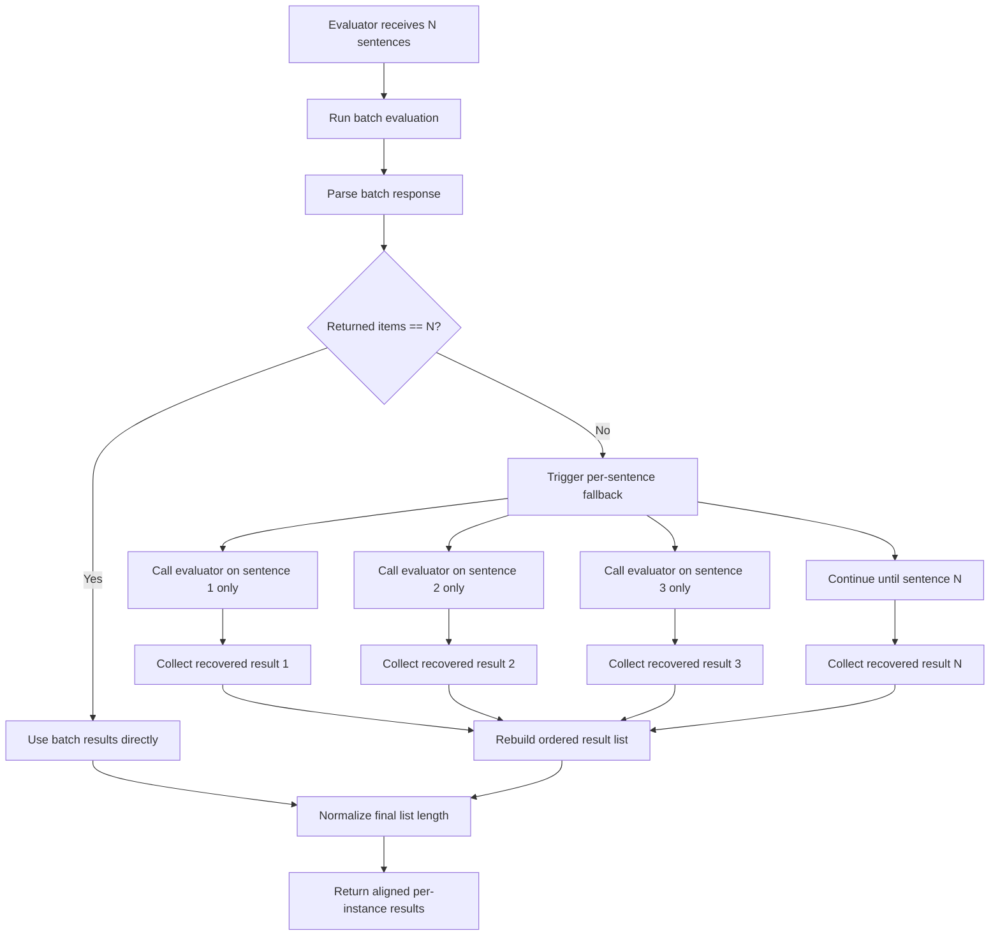
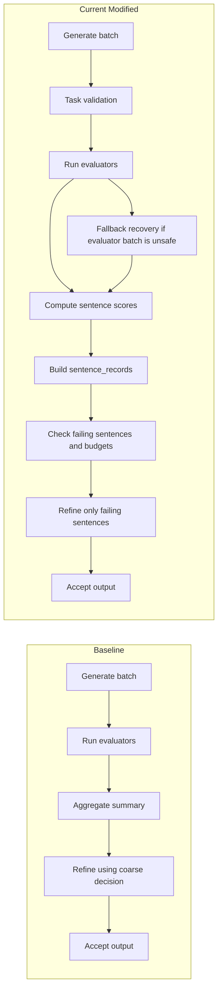

# Pipeline Current Status And Diagrams

## 1. Current Status

The modified pipeline is now beyond the original baseline in three main areas:

1. **Sentence-level decision making**
   - The pipeline no longer depends only on a single aggregate score.
   - Each generated sentence receives its own weighted score.
   - Low-scoring sentences are identified individually.

2. **Targeted refinement**
   - The refiner no longer needs to rewrite the full batch by default.
   - Failing sentences are tracked by index.
   - Per-sentence refinement budgets are tracked with `instance_refine_counts`.

3. **Per-sentence records + fallback protection**
   - `sentence_records` now exists alongside the old array-based structure.
   - Each sentence record stores the full typed evaluator responses, not just numeric scores.
   - Evaluators now use batch-first execution with automatic per-sentence fallback recovery when batch output shape is unsafe.

---

## 2. What Is Implemented

### 2.1 Sentence-level scoring and routing
Implemented in the core flow:
- `sentence_scores`
- `failing_sentence_indices`
- `instance_refine_counts`
- sentence-aware routing to refinement

Behavior:
- Weighted score is computed per sentence.
- Any sentence below threshold is marked as failing.
- Routing logic checks whether failing sentences still have refinement budget.

### 2.2 Sentence records
The pipeline now builds a per-sentence canonical structure in addition to the existing parallel arrays.

Each `sentence_records[i]` contains:
- `index`
- `text`
- `fluency` as full `FluencyResponse`
- `naturalness` as full `NaturalnessResponse`
- `cs_ratio` as full `CSRatioResponse`
- `socio_cultural` as full `SocialCulturalResponse`
- `weighted_score`
- `refine_count`
- `status`
- `task_passed`

This improves traceability and prepares the pipeline for eventually moving away from fragile parallel arrays.

### 2.3 Evaluator fallback recovery
Each evaluator now follows this strategy:
1. Try the normal batch evaluation.
2. Parse the batch response.
3. If the number of returned items does not match the number of input sentences, trigger fallback.
4. Re-run the evaluator sentence-by-sentence.
5. Rebuild the evaluator result list in the correct sentence order.

This was added without changing the evaluator prompts.

---

## 3. What Was Validated

### 3.1 Structural validation
Verified successfully:
- `sentence_records` stores full typed response objects.
- record status logic works: `pass`, `fail`, `refined_pass`, `budget_exhausted`.
- missing task validation is handled gracefully.
- empty input cases do not crash.

### 3.2 Runtime validation
Verified successfully:
- core files compile cleanly.
- the real pipeline still runs.
- the reviewer script still runs after the changes.
- fallback recovery was explicitly triggered during testing and confirmed active.

### 3.3 What the validation means
This does **not** mean the pipeline is perfect.
It means:
- the new sentence-level features are integrated,
- the added safety logic does not break the normal run,
- the fallback recovery path is real and executable,
- the code is in a safer experimental state than before.

---

## 4. What Problem Was Solved

### The original risk
The pipeline depended on multiple parallel arrays staying perfectly aligned:
- `data_generation_result[i]`
- `fluency_results_per_instances[i]`
- `naturalness_results_per_instances[i]`
- `cs_ratio_results_per_instances[i]`
- `social_cultural_results_per_instances[i]`

If one evaluator returned fewer items than expected, later values could shift to the wrong sentence.

### What is solved now
If an evaluator batch output is malformed or too short:
- the system does not silently trust the broken batch,
- it falls back to sentence-by-sentence evaluation,
- the final evaluator result list is rebuilt with the correct length and order.

### What is not fully solved yet
If a batch response has the correct length but internally assigns the wrong content to the wrong sentence, the pipeline still cannot prove semantic identity without explicit sentence IDs.

So the current state is:
- **length mismatch / broken batch shape:** now protected
- **semantic identity mismatch with same-length output:** still a theoretical remaining risk

---

## 5. Remaining Limitations

### 5.1 Parallel arrays still exist
The pipeline is not yet fully record-first.
`sentence_records` is additive, but other parts of the code still depend on the legacy array structure.

### 5.2 Fallback is a recovery mechanism, not a full identity system
The current fix handles malformed batch output well.
It does not fully solve the case where the model returns the wrong sentence analysis in the wrong position while keeping the total count correct.

### 5.3 CS ratio remains the weakest quality dimension
Recent reviewer outputs still show that CS ratio is the lowest average metric and remains a major bottleneck.

### 5.4 Refinement quality still depends on prompt behavior
The routing and per-sentence logic are improved, but final refinement quality still depends on how well the refiner preserves task intent and code-switching quality.

---

## 6. Current Architecture Diagram



### Reading the diagram
- Quality evaluation happens after generation and task validation.
- `SummarizeResult` now does more than aggregate scoring.
- It computes sentence-level scores and builds sentence records.
- Refinement loops only when sentence-level conditions require it.

---

## 7. Evaluator Fallback Diagram



### Why this matters
This is the main robustness improvement added recently.
It prevents malformed batch output from silently corrupting sentence-to-score alignment.

---

## 8. Sentence Record Structure Diagram

```mermaid
flowchart LR
    A[data_generation_result[i]] --> B[sentence_records[i]]
    C[fluency_results_per_instances[i]] --> B
    D[naturalness_results_per_instances[i]] --> B
    E[cs_ratio_results_per_instances[i]] --> B
    F[social_cultural_results_per_instances[i]] --> B
    G[sentence_scores[i]] --> B
    H[instance_refine_counts[i]] --> B
    I[task_validation_result per sentence] --> B

    B --> J[index]
    B --> K[text]
    B --> L[fluency full response]
    B --> M[naturalness full response]
    B --> N[cs_ratio full response]
    B --> O[socio_cultural full response]
    B --> P[weighted_score]
    B --> Q[refine_count]
    B --> R[status]
    B --> S[task_passed]
```

### Why this matters
This is the new internal direction of the pipeline.
It gives one place to inspect the full lifecycle of a sentence instead of mentally syncing multiple arrays.

---

## 9. Practical Interpretation For Thesis Work

At this point, the pipeline can be described as:

- **baseline + sentence-aware evaluation and refinement**
- **record-enhanced state representation**
- **recovery-protected evaluator pipeline**

That is a meaningful methodological improvement because it addresses:
- traceability,
- alignment safety,
- sentence-level controllability,
- clearer experimental diagnostics.

This is a stronger research artifact than the original batch-only aggregate pipeline.

---

## 10. Recommended Next Priorities

1. Make `sentence_records` the canonical internal structure and keep arrays only for compatibility/export.
2. Add sentence-record visibility to export or Excel reporting.
3. Improve refiner quality so sentence-level routing results in better post-refinement outputs.
4. Improve CS-ratio performance since it remains the weakest quality signal.
5. If needed later, add identity-aware evaluator outputs; that would close the remaining theoretical same-length misassignment risk.

---

## 11. Bottom Line

**Current status:**
- sentence-level refinement is implemented,
- per-sentence records are implemented,
- evaluator fallback recovery is implemented,
- runtime regression checks passed,
- the code is in a safer and more defensible thesis state than before.

**Not finished yet:**
- full migration away from parallel arrays,
- full identity-proof evaluator alignment,
- stronger refinement quality,
- stronger CS-ratio outcomes.

---

## 12. Baseline Vs Current Modified Pipeline

### 12.1 What the baseline did
The original baseline pipeline was simpler and more fragile in the following ways:

1. It relied mainly on aggregate evaluator outputs.
2. It did not provide a strong per-sentence lifecycle view.
3. It did not maintain per-sentence refinement state.
4. It did not include the new `sentence_records` structure.
5. It did not include evaluator fallback recovery for malformed batch output.

In practice, baseline behavior was closer to:
- generate a batch,
- score the batch,
- decide using aggregate values,
- refine at a coarser level.

### 12.2 What the current modified version adds over baseline

The current modified version now surpasses the baseline in these concrete ways:

1. **Sentence-level weighted scoring**
    - baseline: aggregate-oriented scoring
    - current: each sentence gets an independent weighted score

2. **Failing sentence identification**
    - baseline: no strong sentence-level failure targeting
    - current: `failing_sentence_indices` identifies exactly which sentence needs attention

3. **Per-sentence refinement budgets**
    - baseline: refinement control was much coarser
    - current: `instance_refine_counts` tracks retry budget per sentence

4. **Per-sentence structured state**
    - baseline: parallel arrays and aggregate fields were the main representation
    - current: `sentence_records` stores a unified per-sentence record with all quality dimensions

5. **Fallback recovery for unsafe batch outputs**
    - baseline: malformed evaluator batch output could silently damage alignment
    - current: evaluators recover sentence-by-sentence when batch output shape is unsafe

6. **Better research traceability**
    - baseline: harder to explain one sentence's lifecycle end-to-end
    - current: easier to inspect sentence text, scores, validation, refinement count, and status in one place

### 12.3 Why this matters academically

For thesis work, the modified pipeline is stronger than the baseline because it improves:

1. **internal validity**
    - less risk that one evaluator failure corrupts downstream sentence alignment silently

2. **observability**
    - easier to inspect where quality breaks down at sentence level

3. **reproducibility of analysis**
    - sentence records provide a clearer experimental artifact than only aggregate metrics

4. **defensibility of claims**
    - it is easier to justify that refinement and scoring decisions were made with finer granularity than in baseline

---

## 13. Baseline Vs Current Diagram



### 13.1 Interpretation of the comparison diagram

The baseline path is simpler, but it gives less control and less protection.

The current modified path adds:
- task validation,
- sentence-level decision making,
- sentence records,
- selective refinement,
- evaluator recovery logic.

So the current pipeline is not just "more features".
It is structurally more reliable and more suitable for detailed experimental analysis.
