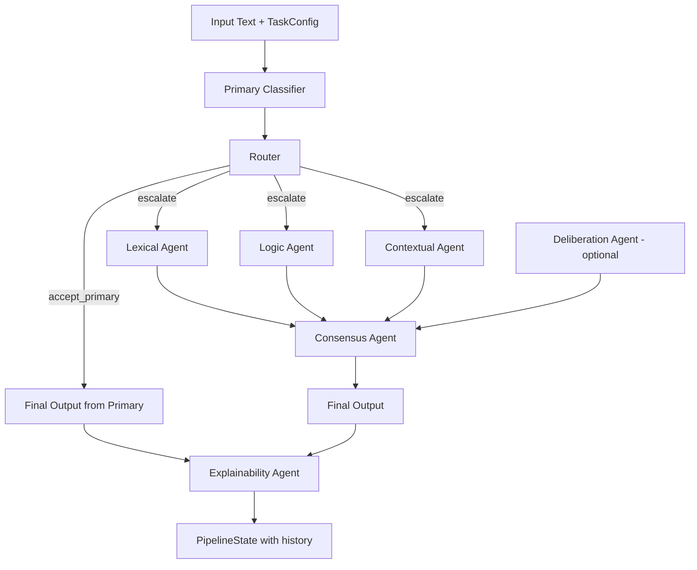

# Multi-Agent BERT Pipeline Report

Date: 2026-05-02
Project: multi-agent-bert
Status: Stable and test-verified

## 1) Executive Summary

This project is a stateful multi-agent text-classification pipeline with:
- Primary classifier stage
- Confidence-based routing
- Specialist agent escalation path
- Consensus aggregation
- Explainability output
- Evaluation and ablation framework

Recent status:
- Full test suite currently passing in this workspace snapshot.
- Latest confirmed run: 314 passed.

## 2) High-Level Architecture



## 3) Core Components

- Pipeline orchestrator
  - Controls execution order and error handling.
  - Fast path when router accepts primary prediction.
  - Escalation path for specialist agents and consensus.

- Router
  - Reads primary confidence and compares to threshold.
  - Decision: accept_primary or escalate.

- Specialist agents
  - Lexical agent: keyword-driven signal.
  - Logic agent: regex/rule-based signal.
  - Contextual agent: LLM-based signal.
  - Deliberation agent (optional): additional vote/review stage.

- Consensus agent
  - Weighted vote across available agent outputs.
  - Includes deliberation weight when enabled.

- Explainability agent
  - Produces short/long explanation based on route.

- Shared state
  - PipelineState is the central data contract.
  - All stages write structured outputs + append history events.

## 4) Execution Flow

### Fast path (accept_primary)
1. Primary classifier predicts label + confidence.
2. Router accepts result if confidence >= threshold.
3. Final output is set from primary result.
4. Explainability agent adds concise explanation.

### Escalation path
1. Router decides escalate when confidence < threshold.
2. Lexical, logic, contextual stages run.
3. Deliberation runs only when enabled.
4. Consensus computes final decision from weighted votes.
5. Explainability agent writes full explanation.

## 5) Evaluation Framework

Implemented capabilities:
- Modes:
  - primary_only
  - full_pipeline
  - both
- Metrics:
  - accuracy
  - macro F1
  - per-class precision/recall/F1/support
  - escalation rate
  - escalated-subset accuracy
- Outputs:
  - predictions JSON/CSV
  - metrics JSON/CSV

CLI entry point:
- evaluate_pipeline.py

## 6) Ablation Framework

Implemented capabilities:
- Config-driven variants from YAML or JSON
- Enable/disable agents per variant
- Override consensus weights per variant
- Optional per-variant threshold override
- Comparison report table across all variants
- Saved outputs:
  - ablation comparison JSON/CSV
  - per-configuration detailed evaluator outputs

Config schema (top-level):
- ablations: [ ... ]

## 7) Current Test Status

Latest verified status in this workspace:
- Full regression suite: 314 passed

Notes:
- Historical terminal logs include earlier intermediate counts (168/173/199/229/268) during iterative development.
- Final integrated state is the 314-pass run.

## 8) Operational Commands

Run full tests:

```powershell
C:\Users\Eng.Donia\Documents\matser\SwitchLingua\.venv\Scripts\pytest.exe tests\ --tb=short
```

Run evaluator:

```powershell
python evaluate_pipeline.py --dataset data/eval.jsonl --mode both --output_dir results
```

Run ablation study:

```powershell
python evaluate_pipeline.py --dataset data/eval.jsonl --ablation_config ablations.yaml --output_dir results
```

## 9) Key Design Notes

- Router is instantiated with no constructor args and reads threshold from task config.
- Deliberation is optional and off by default unless enabled.
- Disabled ablation agents are represented by no-op placeholders so execution remains traceable in history.
- The implementation favors deterministic, testable behavior and explicit saved outputs.

## 10) Next Practical Step

If you want actionable insight, run one real ablation config set on your target dataset and compare:
- macro F1 change per variant
- escalation rate shifts
- per-class F1 gains/losses

That gives a direct answer to which specialist stages contribute most in your real distribution.
